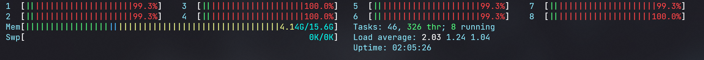

# aw06

1. 选用数据集为```meta_AMAZON_FASHION.json```(185M), ```meta_Books.json```(3.8G)
2. 使用mysql数据库存储, 并且利用mybatis框架访问数据库
3. split分割(每10000行为1个文件)成多个文件, 并且增大chunk_size.
4. 在虚拟机分配了8个核的情况下, 设置线程数为16, 最终运行时间为**52s600ms**. 如图为工作时的截图, 可见所有的cpu核心利用率都达到了**99%以上**

5. 在aw04中新开了一个aw06的分支, 用来与此数据库适配集成, 效果图如下:


[Amazon Review Data (2018)](https://nijianmo.github.io/amazon/index.html) has a huge products metadata set of multiple categories.

|category| reviews | metadata |
|--| -- | -- |
|Amazon Fashion|reviews (883,636 reviews)|metadata (186,637 products)|
|All Beauty|reviews (371,345 reviews)|metadata (32,992 products)|
|Appliances|reviews (602,777 reviews)|metadata (30,459 products)|
| ... |
|Tools and Home Improvement|reviews (9,015,203 reviews)|metadata (571,982 products)|
Toys and Games|reviews (8,201,231 reviews)|metadata (634,414 products)|
Video Games|reviews (2,565,349 reviews)|metadata (84,893 products)|

Please finish the following tasks:

- Download no less than two categories of these metadata.
- Referring the example code in this repo, convert each line in the downloaded files into a POJO of `Product` class and save the object in a database like MySQL. 
- Integrate the database containing Amazon products with your own AW04 project and build an Amazon WebPOS system.


And, of course, always try to make the system run as fast as possible.